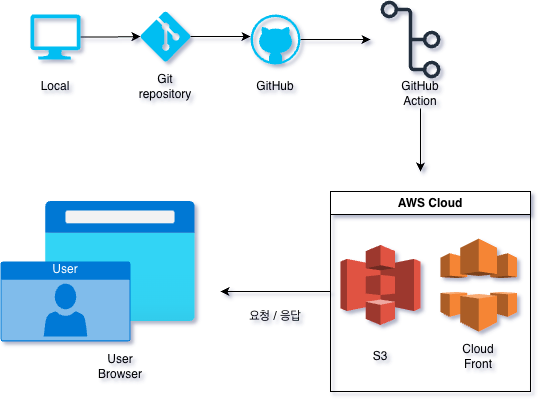

## 프론트엔드 배포 파이프라인

GitHub Actions에 워크플로우를 작성해 다음과 같이 배포가 진행되도록 합니다.

1. 저장소를 체크아웃합니다.
2. Node.js 18.x 버전을 설정합니다.
3. 프로젝트 의존성을 설치합니다.
4. Next.js 프로젝트를 빌드합니다.
5. AWS 자격 증명을 구성합니다.
6. 빌드된 파일을 S3 버킷에 동기화합니다.
7. CloudFront 캐시를 무효화합니다.

## 주요 링크

- s3 버킷 웹사이트 엔드포인트 
: http://amzn-s3-mijeon-bucket0.s3-website-ap-southeast-2.amazonaws.com/
- CloudFrount 배포 도메인 이름
: [d26vz7r83p6mdq.cloudfront.net](https://d26vz7r83p6mdq.cloudfront.net/)

## 주요 개념

- GitHub Actions과 CI/CD 도구:

  - CI/CD는 '지속적 통합(Continuous Integration)'과 '지속적 배포(Continuous Deployment)'의 약자
  - GitHub Actions는 GitHub에서 제공하는 자동화 도구로, 코드 변경사항이 발생할 때마다 자동으로 빌드, 테스트, 배포를 수행
  - 개발자가 코드를 push하면 자동으로 정의된 작업들이 순차적으로 실행되어 수동 작업 없이 배포까지 완료

- S3와 스토리지:

  - Amazon S3(Simple Storage Service)는 AWS에서 제공하는 클라우드 스토리지 서비스
  - 정적 웹사이트 호스팅 기능을 제공하여 HTML, CSS, JavaScript 파일을 저장하고 웹사이트로 서비스할 수 있음
  - 높은 내구성과 가용성을 제공하며, 저렴한 비용으로 대용량 파일을 저장할 수 있습니다

- CloudFront와 CDN:

  - CloudFront는 AWS의 CDN(Content Delivery Network) 서비스입니다
  - 전 세계에 분산된 엣지 로케이션을 통해 콘텐츠를 캐싱하고 사용자와 가까운 위치에서 콘텐츠를 제공합니다
  - 이를 통해 웹사이트의 로딩 속도가 개선되고, 원본 서버의 부하가 감소됩니다

- 캐시 무효화(Cache Invalidation):
  - CDN은 콘텐츠를 캐싱하여 빠른 응답을 제공하지만, 웹사이트 업데이트 시 이전 버전이 계속 제공될 수 있습니다
  - 캐시 무효화는 CDN의 캐시를 강제로 삭제하여 최신 콘텐츠가 사용자에게 전달되도록 하는 과정입니다
  - CloudFront에서는 특정 파일 또는 전체 캐시를 무효화할 수 있습니다

- Repository secret과 환경변수:
  - 민감한 정보(API 키, 접근 토큰 등)를 코드에 직접 포함하지 않고 안전하게 관리하는 방법입니다
  - GitHub의 Repository secrets 기능을 통해 암호화되어 저장되며, 권한이 있는 워크플로우에서만 접근할 수 있습니다
  - CI/CD 파이프라인에서 AWS 인증 정보 등을 안전하게 사용할 수 있게 해줍니다

### 주요 AWS Secrets 설정

1. **AWS_ACCESS_KEY_ID**

- AWS IAM 사용자의 액세스 키 ID

2. **AWS_SECRET_ACCESS_KEY**

- AWS IAM 사용자의 비밀 액세스 키

3. **AWS_REGION**

- AWS 리소스가 위치한 리전
- 일반적인 값:
  - ap-northeast-2 (서울)
  - us-east-1 (버지니아)
  - us-west-2 (오레곤)
  - 등등 리전 값들 존재

4. **S3_BUCKET_NAME**

- 배포 대상 S3 버킷 이름
- 예시: my-frontend-deploy-bucket
- 주의: 버킷 이름은 **전역적으로 고유**해야 함

5. **CLOUDFRONT_DISTRIBUTION_ID**

- CloudFront 배포 ID
- 예시: E1KTCKT0EXAMPLE

### GitHub에서 설정하는 방법

1. GitHub 저장소 접속
2. Settings > Secrets and variables > Actions 선택
3. 'New repository secret' 클릭
4. Name과 Value 입력

### 보안 주의사항

- Secret 값들은 절대 코드나 로그에 노출되지 않도록 주의
- IAM 사용자에게는 필요한 최소한의 권한만 부여
- Access Key는 정기적으로 교체하는 것이 좋음
- GitHub Repository Secret은 암호화되어 저장되며 한번 저장하면 다시 볼 수 없음

# Basic

## 배포 파이프라인을 설명하는 다이어그램과 설명

  

- 개발자가 코드를 GitHub 저장소에 Push하면 GitHub Actions 워크플로우가 자동으로 실행 (deployment.yml)
  (deployment.yml 에 작성해놓은 스크립트 실행)
- 저장소에서 코드를 체크아웃하여 작업 환경에 가져옴
- Node.js 18.x 환경을 설정하여 프로젝트를 빌드하는 데 필요한 런타임을 준비
- 프로젝트에 필요한 의존성을 설치
- Next.js 프로젝트를 빌드하여 정적 파일을 생성
- AWS 인증 정보를 설정하여 빌드된 파일을 S3 버킷에 업로드
- CloudFront 캐시를 무효화하여 최신 버전의 콘텐츠가 사용자에게 전달
- S3와 CloudFront에 배포되어 사용자들에게 전달